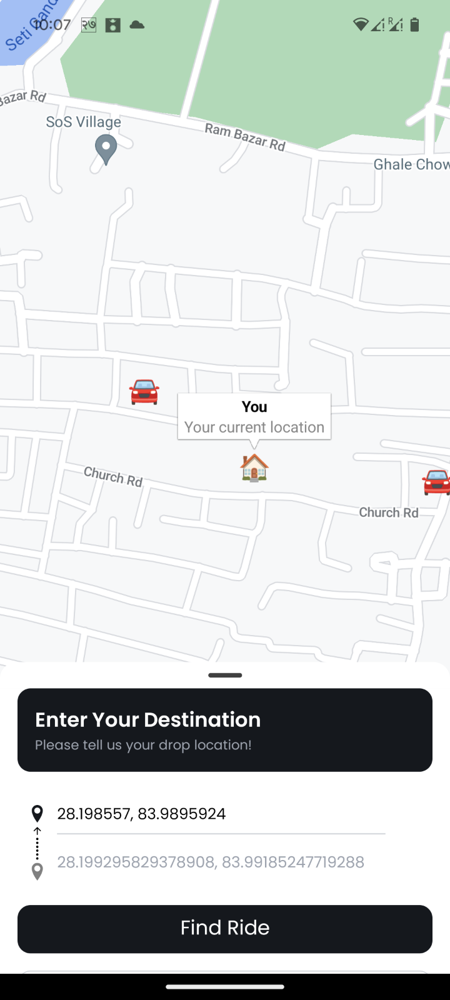
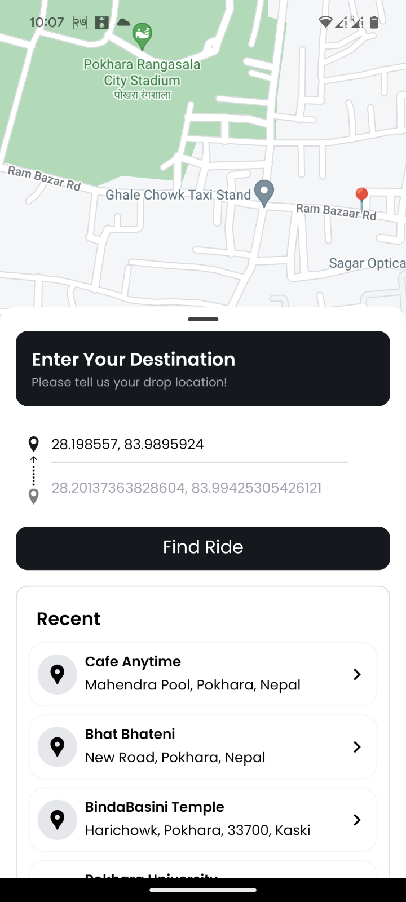
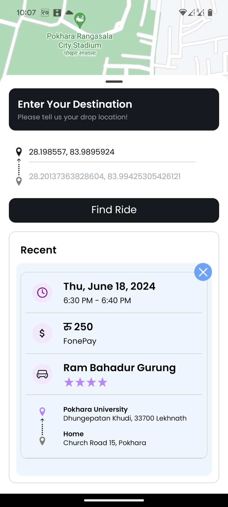
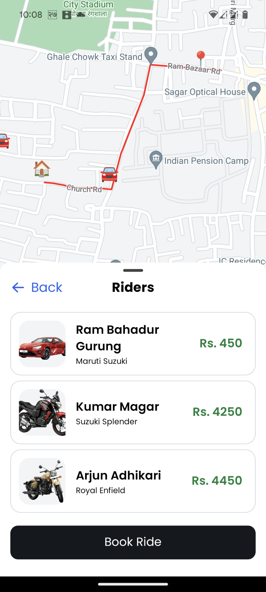
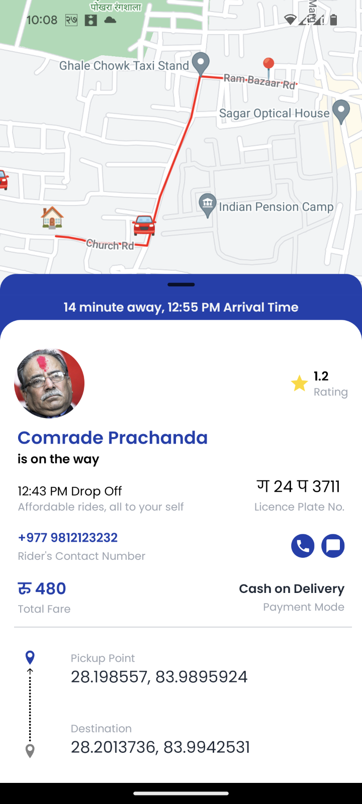

# Maps

Simple react native map and shortest path between two place implementation using `A* algorithm`.

### Implementation of A\* Algorithm

- Initializes with the start node.
- Uses a priority queue to manage the open set.
- Expands nodes, calculates costs, and updates paths.
- Stops when the goal is reached

### Project Structure

`server/scripts`: Contains necessary scripts to prepopoulate data, currently `map-graph.db` contains 650k node data of kaski district

`app/*` : contains simple ui implementation in react native

## Screenshots

